# English to TikZ

This codebase provides two way to generate TikZ code more intuitvely. A domain specific language: **DescribeIt**, and a vim-like GUI program for editing diagrams in a WYGIWYS manner.

## DescribeIt

This is a domain specific language that can be compiled into TikZ, which can be directly put in a latex file to produce diagrams. For example, the following python code

```python
from english2tikz import DescribeIt
di = DescribeIt()
di.parse(r"""
there.is.a.tree.with.branches.2.2.2.1.1.1.1
  with.texts "$\mathsf{H}$"
    "$\mathsf{h0}$" "$\mathsf{h1}$"
    "$\mathsf{h00}$" "$\mathsf{h01}$" "$\mathsf{h10}$" "$\mathsf{h11}$"
    "$a$" "$b$" "$c$" "$d$"
  with.names "root" "h0" "h1" "h00" "h01" "h10" "h11" "a" "b" "c" "d"
for.all.text with.tree without.tree.layer=3
  set.draw set.rounded.corners
for.all.text where.tree.role=left with.tree.layer=1
  set.xshift=-0.6cm
for.all.text where.tree.role=right with.tree.layer=1
  set.xshift=0.6cm
for.all.text where.tree.role=left with.tree.layer=2
  set.xshift=-0.08cm
for.all.text where.tree.role=right with.tree.layer=2
  set.xshift=0.08cm
for.all.text where.tree.layer=1
  set.yshift=-0.2cm
for.all.text where.tree.layer=2
  set.yshift=-0.2cm
for.all.text where.tree.layer=3
  set.yshift=-0.5cm
for.all.text where.name=root set.fill=blue!20
draw from.root.south point.to.h0
draw from.root.south point.to.h1
draw from.h0.south point.to.h00
draw from.h0.south point.to.h01
draw from.h1.south point.to.h10
draw from.h1.south point.to.h11
for.all.path set.blue
draw with.dashed from.h00 point.to.a
draw with.dashed from.h01 point.to.b
draw with.dashed from.h10 point.to.c
draw with.dashed from.h11 point.to.d
there.is.a.4.by.4.grid.aligned.center.right with.texts
  "A" "B" "Long" "D"
  "E" "F" "G" "H"
  "$\begin{array}{c}J\\V\end{array}$" "J" "K" "L"
  "M" "N" "O" "P"
  with.draw with.width=0.8cm with.height=0.8cm
for.all.text where.origin set.below.of.a by.0.5cm
for.all.text where.even.row set.fill=green!20
for.all.text with.text "P" set.red
for.all.text with.row=1 with.col=1 set.fill=green!50!black
""")
tikz = di.render()
print(tikz)
```
produces the following tikz code
```latex
\begin{tikzpicture}
  \node[rounded corners, fill=blue!20, draw] (id0) {$\mathsf{H}$};
  \node[rounded corners, xshift=-0.6cm, yshift=-0.2cm, anchor=north east, at=(id0.south), draw] (id1) {$\mathsf{h0}$};
  \node[rounded corners, xshift=0.6cm, yshift=-0.2cm, anchor=north west, at=(id0.south), draw] (id2) {$\mathsf{h1}$};
  \node[rounded corners, xshift=-0.08cm, yshift=-0.2cm, anchor=north east, at=(id1.south), draw] (id3) {$\mathsf{h00}$};
  \node[rounded corners, xshift=0.08cm, yshift=-0.2cm, anchor=north west, at=(id1.south), draw] (id4) {$\mathsf{h01}$};
  \node[rounded corners, xshift=-0.08cm, yshift=-0.2cm, anchor=north east, at=(id2.south), draw] (id5) {$\mathsf{h10}$};
  \node[rounded corners, xshift=0.08cm, yshift=-0.2cm, anchor=north west, at=(id2.south), draw] (id6) {$\mathsf{h11}$};
  \node[yshift=-0.5cm, anchor=north, at=(id3.south)] (id7) {$a$};
  \node[yshift=-0.5cm, anchor=north, at=(id4.south)] (id8) {$b$};
  \node[yshift=-0.5cm, anchor=north, at=(id5.south)] (id9) {$c$};
  \node[yshift=-0.5cm, anchor=north, at=(id6.south)] (id10) {$d$};
  \path[blue, draw, -stealth] (id0.south) -- (id1);
  \path[blue, draw, -stealth] (id0.south) -- (id2);
  \path[blue, draw, -stealth] (id1.south) -- (id3);
  \path[blue, draw, -stealth] (id1.south) -- (id4);
  \path[blue, draw, -stealth] (id2.south) -- (id5);
  \path[blue, draw, -stealth] (id2.south) -- (id6);
  \path[draw, -stealth, dashed] (id3) -- (id7);
  \path[draw, -stealth, dashed] (id4) -- (id8);
  \path[draw, -stealth, dashed] (id5) -- (id9);
  \path[draw, -stealth, dashed] (id6) -- (id10);
  \node[fill=green!20, below=0.5cm of id7, minimum width=0.8cm, minimum height=0.8cm, draw] (id11) {A};
  \node[fill=green!20, anchor=west, at=(id11.east), minimum width=0.8cm, minimum height=0.8cm, draw] (id12) {B};
  \node[fill=green!20, anchor=west, at=(id12.east), minimum width=0.8cm, minimum height=0.8cm, draw] (id13) {Long};
  \node[fill=green!20, anchor=west, at=(id13.east), minimum width=0.8cm, minimum height=0.8cm, draw] (id14) {D};
  \node[anchor=north east, at=(id11.south east), minimum width=0.8cm, minimum height=0.8cm, draw] (id15) {E};
  \node[fill=green!50!black, anchor=east, at=(id12.east |- id15.center), minimum width=0.8cm, minimum height=0.8cm, draw] (id16) {F};
  \node[anchor=east, at=(id13.east |- id15.center), minimum width=0.8cm, minimum height=0.8cm, draw] (id17) {G};
  \node[anchor=east, at=(id14.east |- id15.center), minimum width=0.8cm, minimum height=0.8cm, draw] (id18) {H};
  \node[fill=green!20, anchor=north east, at=(id15.south east), minimum width=0.8cm, minimum height=0.8cm, draw] (id19) {$\begin{array}{c}J\\V\end{array}$};
  \node[fill=green!20, anchor=east, at=(id12.east |- id19.center), minimum width=0.8cm, minimum height=0.8cm, draw] (id20) {J};
  \node[fill=green!20, anchor=east, at=(id13.east |- id19.center), minimum width=0.8cm, minimum height=0.8cm, draw] (id21) {K};
  \node[fill=green!20, anchor=east, at=(id14.east |- id19.center), minimum width=0.8cm, minimum height=0.8cm, draw] (id22) {L};
  \node[anchor=north east, at=(id19.south east), minimum width=0.8cm, minimum height=0.8cm, draw] (id23) {M};
  \node[anchor=east, at=(id12.east |- id23.center), minimum width=0.8cm, minimum height=0.8cm, draw] (id24) {N};
  \node[anchor=east, at=(id13.east |- id23.center), minimum width=0.8cm, minimum height=0.8cm, draw] (id25) {O};
  \node[red, anchor=east, at=(id14.east |- id23.center), minimum width=0.8cm, minimum height=0.8cm, draw] (id26) {P};
\end{tikzpicture}
```
that is compiled to the following graph by latex.
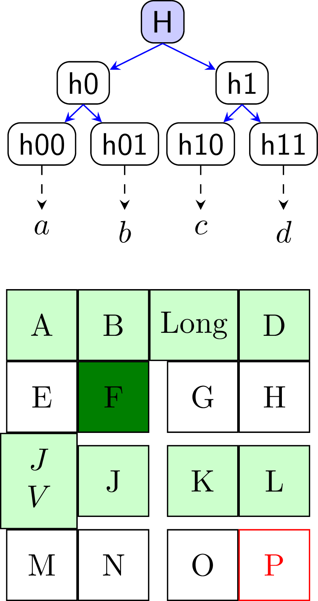

## GUI Program

The program is based on Tkinter. It implements most of the basic functionalities of Tikz, suffices for basic diagram editing.

To run the program, directly `cd` into the project folder, and execute

```bash
$ python gui.py
```

The program will start with an empty diagram.

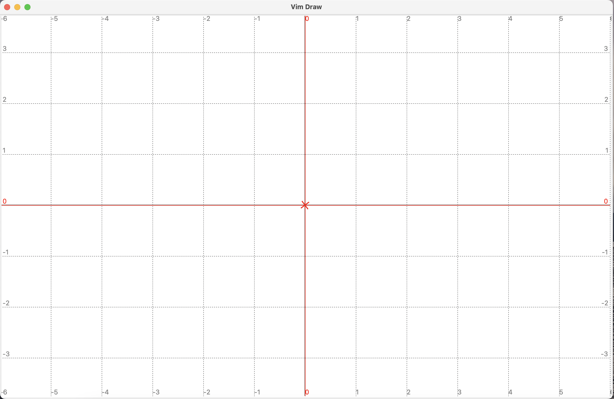

This program has been tested on MacOS and Ubuntu.

The operations are all key-based, and the key settings are mostly based on vim (yes, I like vim very much and tired of drawing diagrams by mouse), i.e., if an operation has a resemblance in vim (except `Esc`, because I think it is too inconvenient for such a frequently used key, especially so in a Macbook with a touch bar! I use `Ctrl-c` to exit inserting mode), then we use the same key. For operations that do not exist in vim, we improvise.

We will describe the available key and their functionalties. For the complete list (the document may be out of date), please directly refer to the code (./gui/editor.py, the function `_register_keys`).

Like vim, the program has many modes. On start up, it is in the default mode: **normal mode**.

### Normal mode

In normal mode, you can move the pointer around in the canvas, select objects on the screen, and operate on the selected objects, e.g., moving the objects around.

| Key                                    | Function                                                     |
| -------------------------------------- | ------------------------------------------------------------ |
| `h`, `j`, `k`, `l`                     | Go left, down, right, or left by one unit in the grid.       |
| `H`, `L`, `M`                          | Move the pointer to the top, bottom, or middle (vertically). |
| `0`, `$`                               | Move the pointer to the left-most or right-most.             |
| `w`, `b`, `E`, `e`                     | Move the pointer left, right, up, or down by distance 1 (regardless of the grid size). |
| `W`, `B`                               | Move the pointer left or right by distance 4 (regardless of the grid size). |
| `Ctrl-e`, `Ctrl-y`                     | Scroll the screen up or down.                                |
| `G`                                    | Go to the origin and reset the origin to the center of the screen. |
| `Ctrl-f`, `Ctrl-g`                     | Adjust the unit size. Available sizes are 1, 0.5, 0.2, 0.1, 0.05. You can modify it in `./gui/grid.py` |
| `n`, `N`                               | Jump to next or previous selected node, if any node is selected. If no node is selected, while exactly one path is selected, then jump to next or previous point in the path. |
| `y`, `p`                               | Copy selected objects to the clipboard, or paste the clipboard. |
| `D`                                    | Delete selected objects. All objects that depend on them will also be deleted. |
| `m`                                    | Add a mark to the screen. If a point in the path is selected, then that point is used as the mark. Otherwise, the coordinate of the pointer is used as the mark. Other types of mark can be created, using the command line. |
| `Ctrl-c`                               | Clear the selection or marks in order: clear the selected path point if any, otherwise clear the selection if any, and finally clear the marks. |
| `i`                                    | Enter edit mode. If exactly one node is selected, then we will be editing the text of this node. If two nodes are selected, then we will use create a node that is aligned with the first node horizontally and with the second node vertically, and edit the text of this new node. If no node is selected, then we insert a new node at the coordinate of the pointer and edit its text. |
| `a`, `I`, `O`, `o`                     | If exactly one node is selected, then create a new node adjacent to the selected node on right, left, above, or below, and enter edit mode to edit the text of this new node. |
| `v`                                    | Enter visual mode.                                           |
| `:`                                    | Enter command mode.                                          |
| `/`                                    | Enter command mode and set the command buffer to `search`.   |
| `f`, `F`                               | Enter finding mode. If use `f`, the found object will be the only object selected. If use `F`, then the found object will be added to the selection or removed if it is already selected. |
| `J`, `K`, `<`, `>`                     | Move the selected nodes (or path point) down, up, left, or right. This will modify either the `x, y` attributes or `xshift, yshift` attributes, depending on how the object is positioned (absolute coordinate or relative to other objects). |
| `Ctrl-h`, `Ctrl-j`, `Ctrl-k`, `Ctrl-l` | This only works on nodes that are positioned at anchors of other nodes. This will move the selected nodes left, down, up, or right by reseting the anchor where this node is positioned. For example, if the anchor was originally `south.east`, shifting left will make it `south`,then shifting up will make it `center`. |
| `Ctrl-w`, `Ctrl-a`, `Ctrl-s`, `Ctrl-d` | Move the selected nodes up, left, down, or right, by reseting its own anchor. For example, if the anchor was originally `center`, then shifting the node left will make the anchor `east`. |
| `u`                                    | Undo.                                                        |
| `Ctrl-r`                               | Redo.                                                        |

### Edit Mode

In edit mode, you can edit the text of the issued node (depending on how you entered edit mode, see the description for keys `i`, `a`, `I`, `o` and `O` above).

Following is the look of the canvas after I pressed `lkiABC` after launching the program. The black rectangle is the cursor (I don't know how to precisely manipulate the style of individual characters in Tkinter canvas `create_text` function, and wonder if it is possible at all, so I simply use the unicode char `u+2588` to represent the cursor).

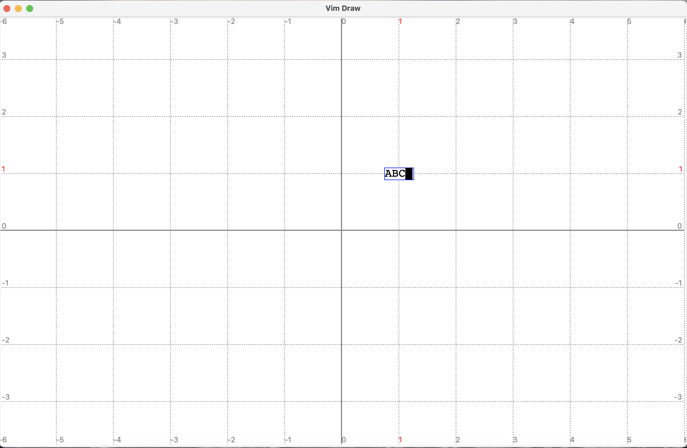

Following are the available keys in editing mode.

| Key                                            | Function                                                     |
| ---------------------------------------------- | ------------------------------------------------------------ |
| printable characters, `<BackSpace>`, `<Enter>` | Edit the text as in a normal editor.                         |
| `Ctrl-c`, `Ctrl-Enter`                         | Exit editing mode. These two keys are just the same, use whichever feels right. Note that `Ctrl-c` does not "cancel", as there is no such operation in vim. If you regret the change to text, simply exit editing mode and press `u` to undo. |
| `Ctrl-h/j/k/l`                                 | Move the cursor left, down, up, or right, in the text. Moving left or right does not cross lines. |
| `<Left>`, `<Right>`                            | Move the cursor left or right in the text. Can cross lines.  |
| `Ctrl-0/g`                                     | Move the cursor to the beginning or end of the text.         |
| `Ctrl-4/6`                                     | Move the cursor to the beginning or end of the current line. |
| `Ctrl-o`                                       | Open Sublime to edit the text (if you installed it). This is only tested on MacOS. I introduced this key for my own convenience, when I feel the editing is intolerable, and never intended to make it a formal functionality. You can modify the source code to use other editors you like. |

After pressing `Ctrl-c` in the canvas shown in the last picture, the canvas becomes

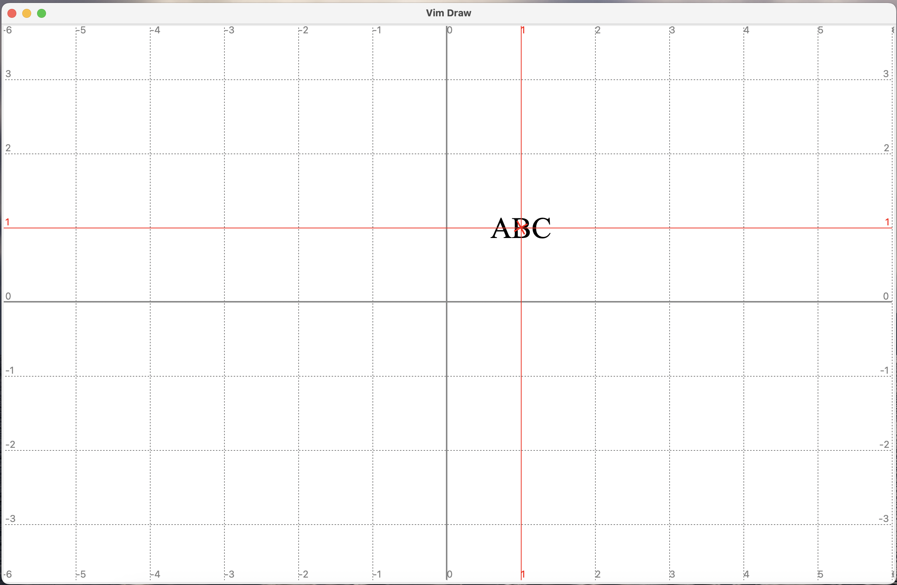

We also support simple latex commands. In fact, whenever the text contains some specific contents, like `\textbf{`, `\begin{` and the math symbol `$`, the text will trigger latex for rendering. If you don't have latex installed, you will get error messages, unless you avoid triggering latex (but this program will be roughly useless if you don't have latex, because it can only produce image via TikZ, except, of course, you can always take screenshots after turning off the grid and axes, if you are satisfied with the tkinter-produced image).

If the latex program is triggered, it will save a cache of the image of this text in the folder `./view`, because rendering the text in latex is relatively slow (roughly 2 seconds on my Macbook, could be faster in desktops). Note that changing the text and some of the attributes of the node will cause the latex to rerun, e.g., `color`, `text.width`. The cached image will not be deleted (unless by you), so if you change the combination of attributes and text back to a setting that was rendered before, the text will change immediately.

We don's support setting text fonts for now. If you want bigger or smaller texts, set `scale` attribute of the node.

### Visual Mode

If press `v` in normal mode, then the editor enters visual mode. Then you can move the pointer around, a dashed rectangle will appear on the screen. This is what is on canvas after pressing `vlk` on the canvas shown in the previous picture.

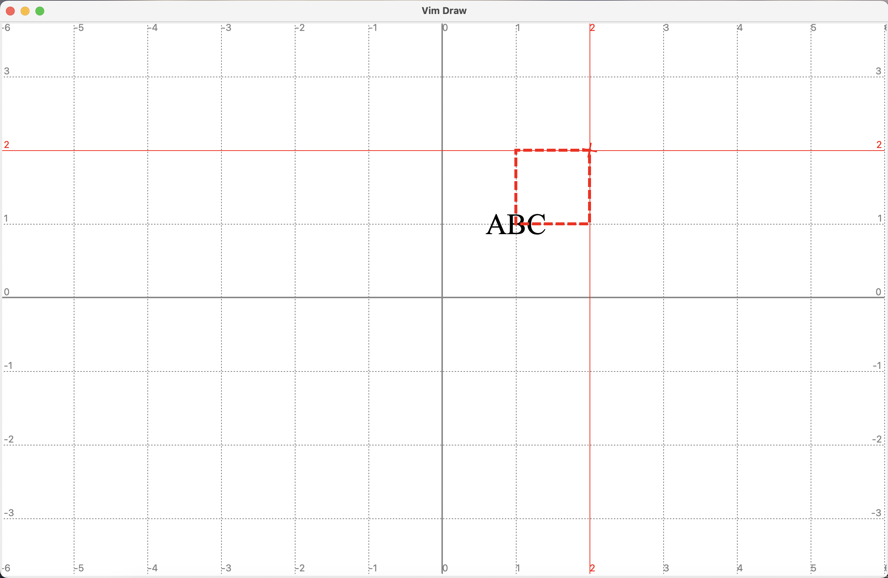

Visual mode is used primarily for selecting objects on the screen. All the keys for moving the pointer work in the same way here. You can also enter command mode by pressing `:` or `/`. We will not repeat introducing such keys. Here we only list keys that are unique to visual mode.

| Key       | Function                                                     |
| --------- | ------------------------------------------------------------ |
| `Ctrl-c`  | Exit visual mode and enter normal mode.                      |
| `i`       | Create a node that occupies the same area of the visual rectangle, and enter edit mode to edit the text of this node. |
| `<Enter>` | Exit visual mode, and select all the objects that intersect with the visual rectangle. Existing selected objects, if any, are deselected. |
| `v`       | Exit visual mode, and select all the objects that intersect with the visual rectangle. Existing selected objects are still selected. |
| `-`       | Exit visual mode and deselect all the objects that intersect with the visual rectangle. Other selected objects are still selected. |
| `^`       | Exit visual mode and select all the objects that are both already selected and intersect with the visual rectangle. Other selected objects are deselected. |

After pressing `<Enter>` on the previous canvas, we get

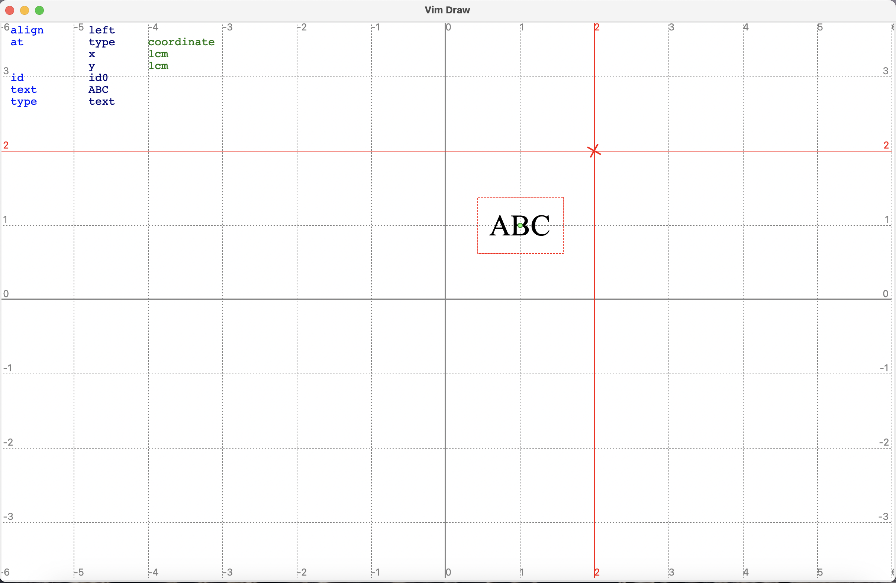

Note that the node with text `ABC` is selected, which is indicated by a thin dashed box around it.

### Command Mode

Pressing `:` in either normal mode or visual mode will enter command mode.

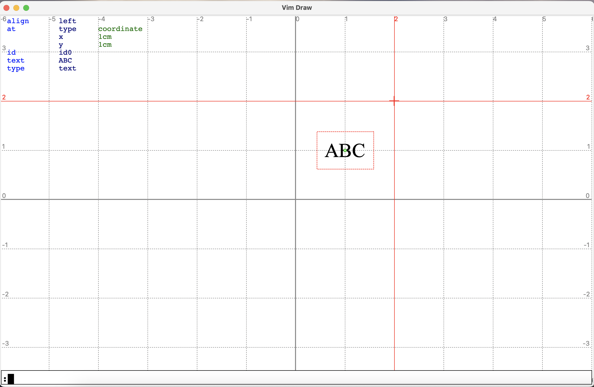

A thin input box appears below, where you can type commands. Press enter to execute the command and `Ctrl-c` to cancel. External editor is still available. Keys in this mode are so simple that we simply skip them. Instead, we will introduce the currently supported commands.

#### set

Usage:

```
set key1=value key2 key3 "value with space"
```

The above example sets the specified attributes of the selected objects: `key1` is set to `value`, `key2` is set to `true`, and `key3` is set to `value with space`.

This is what we get after executing command `set color=blue text "A B C" draw`.

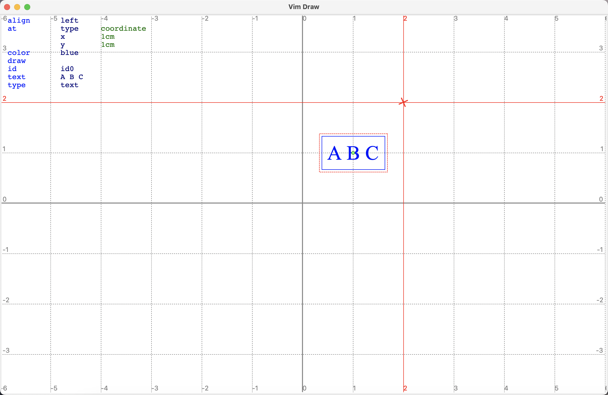

We will not exhaustively introduce the supported attributes. Most attributes are simply ported from TikZ. Since TikZ attributes may contain spaces, which is inconvenient to process in python, so we replace all the spaces with dots `.`, and only replace them back when compiling for tikz code.

The `set` command does not apply strict checks on the validity of the attributes to allow the maximal flexibility. In another word, it is possible to cause the diagram to be in illegal state, in which case exceptions might be thrown. If that happens, simply press `u` to undo, which can save most of the crisis.

In particular, don't try to set `id` of any node.

#### unset

Similar to set, except that it removes the attributes.

#### make

Usage:

```
make (rect|path) [->][<-][<->]
```

Create a path or a rectangle using the marks on the screen. If it is rectangle, the number of marks should be exactly two. Alternatively, making a rectangle in visual mode will create a rectangle that matches the visual rectangle.

If it is path, then `->`, `<-` or `<->` will attach an arrow (or reversed arrow, or double arrow) to the path.

To demonstrate, in the canvas shown in previous picture, press `Ctrl-c` to deselect the node, then press `mlljjm` to create two marks. The canvas looks as follows.


Then execute the command `make rect`. We get the following.

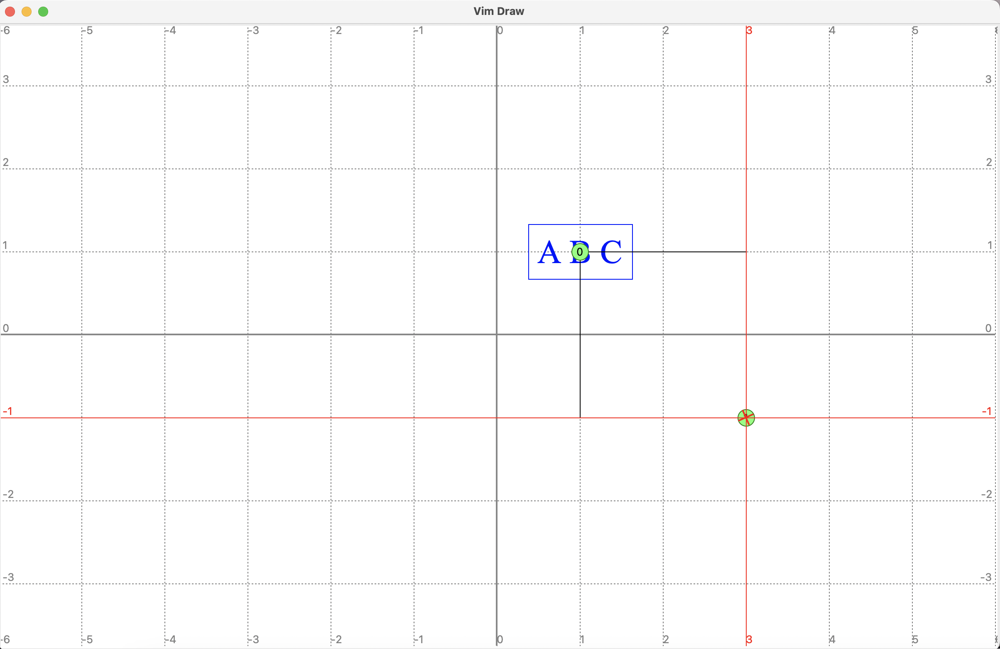

The rectangle is not obvious because two sides are covered by the pointer lines.

Then execute the command `make path`. Now we get

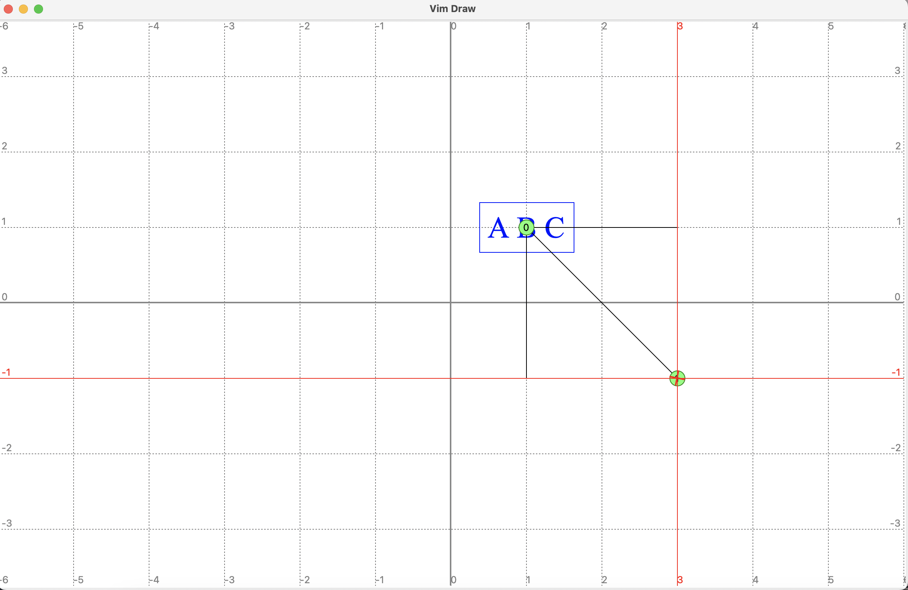

Press `Ctrl-c` to clear the marks and move the pointer away.

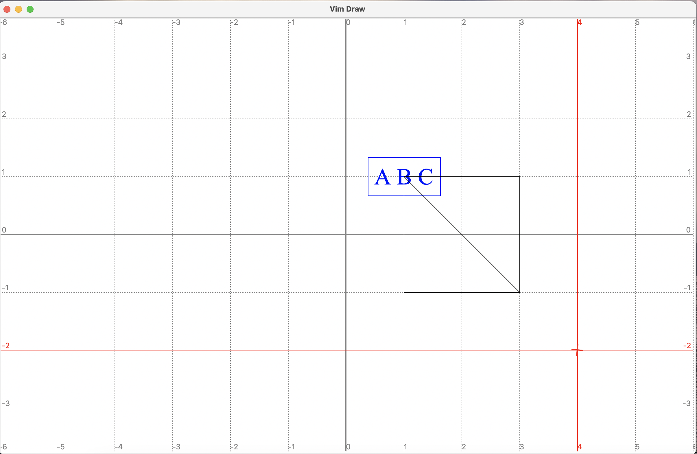

#### connect

Usage:

```
cn [chain] [->][<-][<->] [in=degree] [out=degree] [anchor1] [anchor2]
```

Select two or more nodes, this command will create paths connecting these nodes. If at least three nodes are selected, they are connected in "star" shape by default, i.e., the first node is connected to each of other nodes respectively. The `chain` flag will change the behavior to "chain" mode, i.e., the first node is connected to the second, and the second is connected to the third, etc.

The parameters `in` and `out` make the connecting line a curve instead of a straight line, such that the curve has the specified direction at the beginning or the end.

The `anchor1` and `anchor2`, if set, will connect anchors of nodes instead of just the node.

We will not explain the detailed steps. Here we only demonstrate the canvas before and after the command.

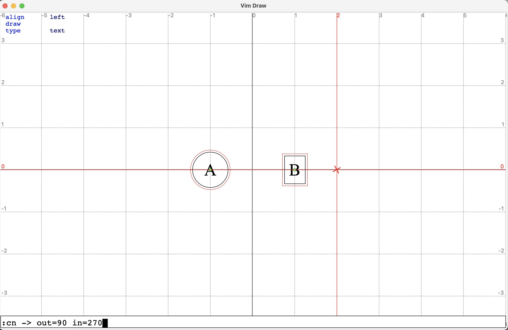

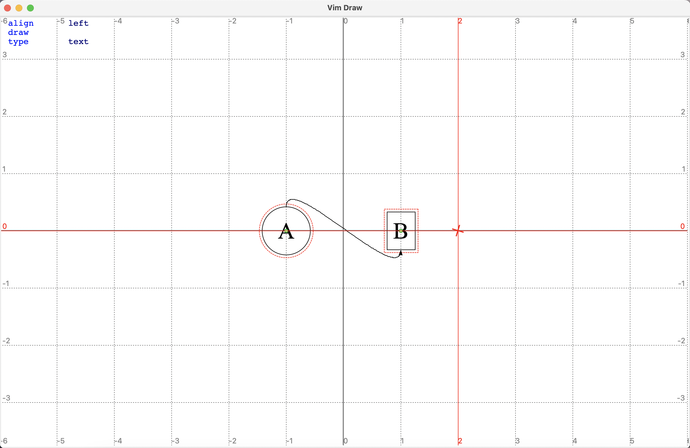

#### Other commands

The above commands suffice to create some basic diagrams. We introduce some additional commands, without giving the examples.

| Command                              | Function                                                     |
| ------------------------------------ | ------------------------------------------------------------ |
| `grid/axes [on] [off]`               | Turn on/off or toggle the grid/axes.                         |
| `attr`                               | Toggle drawing the attributes.                               |
| `mark [anchor]`                      | Mark the specified anchor of the selected node.              |
| `mark [anchor] shift`                | Mark the position of the pointer, not as an absolute coordinate, but as a relative coordinate with respect to the anchor of the selected node. |
| `mark rel`                           | Mark the position of the pointer, not as an absolute coordinate, but as a relative coordinate with respect to the previous mark. |
| `search key1=value1 key2= keyoralue` | Find and select all objects that contain attributes where the key contains `key1` and value contains `value`, and contain attributes where the key contains `key2`, and contain attributes where either the key or the value contain `keyorvalue`. |
| `read path-to-file`                  | Read the picture from a file (in json format) to overwrite the current picture. |
| `w filename`                         | Save the picture to the specified file path, or the opened file (specified in command in when launching the program), or the standard output if no file is opened. |
| `sao name`                           | Save the selected objects together as a reusable building block under name `name` (it will be saved to `$HOME/.english2tikz/name.json`). If nothing is selected, the entire picture will be saved. |
| `ro name`                            | Read the objects named `name` and put it under pointer.      |
| `q`                                  | Exit the program.                                            |
| `view`                               | Preview the picture compiled to TikZ (latex required). In the preview mode, only `Ctrl-c` can be used, to exit preview mode. |
| `epy`                                | Edit the python script to be executed. The python code will have access to many useful methods and variables. This function is introduced to allow the user to do some repeated work programmably. This function is still yet to improve. |
| `py`                                 | Execute the python script.                                   |
| `eeg`                                | Edit the DescribeIt script to be executed.                   |
| `eg`                                 | Execute the DescribeIt script.                               |
| `export filename`                    | Export the image (if filename ends with '.png') or the tikz code to the specified file path. |

### Finding Mode

Pressing `f` or `F` will enter finding mode, in which each object on the screen will be attached with a tag. Input the tag of an object will select the object (or toggle its selection if `F` was pressed).

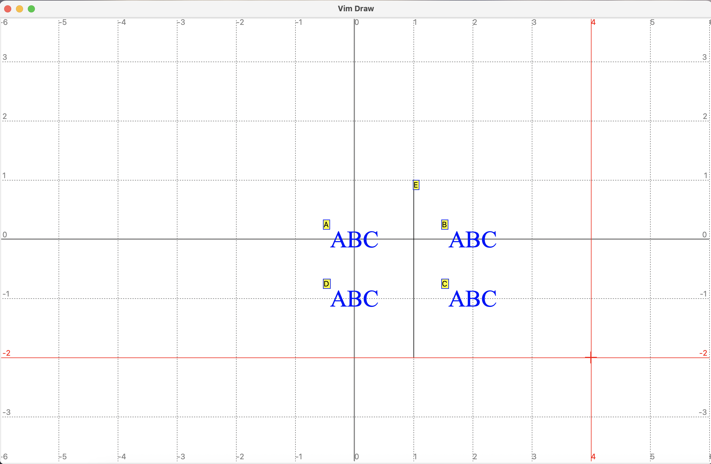

## Remarks

The program is still in active development and in alpha state yet. Use it for fun or for simple drawings. Currently I am using it to draw the illustrative diagrams in my presentation or take notes in technical reading. The current features are mostly sufficient for most situations I encounter, personally, partly because I am more familiar with the source code thus know how to hack it to work as intended.

## Todo

- [ ] Support drawing external image
- [ ] Support setting fonts
- [ ] Support more tikz features
  - [ ] Bezier curve
  - [ ] More shapes
  - [ ] Fine-tuned arrow heads
  - [ ] Transparency
  - [ ] Arcs
  - [ ] Polar coordinates
- [ ] Better handling of the deletion (not just delete all depending objects)
- [ ] Deletion serve as cut
- [ ] Support configuration file (like .vimrc)
- [ ] Support plugin (like vim plugins)
- [ ] Better exception handling
- [ ] Fix issues:
  - [ ] Finding tags may cover each other
  - [ ] Selection indicator covered by other objects
