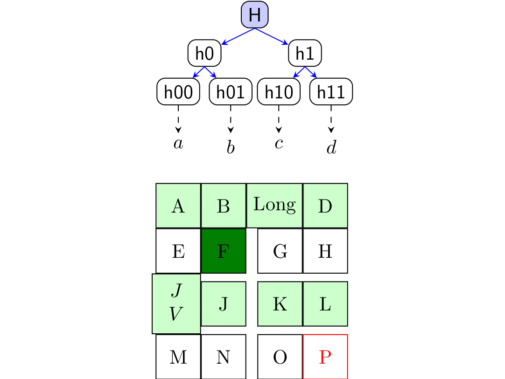

# English to TikZ

A python library for generating TikZ code in an intuitive way. For example

```python
from english2tikz import DescribeIt
di = DescribeIt()
di.parse(r"""
there.is.a.tree.with.branches.2.2.2.1.1.1.1
  with.texts "$\mathsf{H}$"
    "$\mathsf{h0}$" "$\mathsf{h1}$"
    "$\mathsf{h00}$" "$\mathsf{h01}$" "$\mathsf{h10}$" "$\mathsf{h11}$"
    "$a$" "$b$" "$c$" "$d$"
  with.names "root" "h0" "h1" "h00" "h01" "h10" "h11" "a" "b" "c" "d"
for.all.text with.tree without.tree.layer=3
  set.draw set.rounded.corners
for.all.text where.tree.role=left with.tree.layer=1
  set.xshift=-0.6cm
for.all.text where.tree.role=right with.tree.layer=1
  set.xshift=0.6cm
for.all.text where.tree.role=left with.tree.layer=2
  set.xshift=-0.08cm
for.all.text where.tree.role=right with.tree.layer=2
  set.xshift=0.08cm
for.all.text where.tree.layer=1
  set.yshift=-0.2cm
for.all.text where.tree.layer=2
  set.yshift=-0.2cm
for.all.text where.tree.layer=3
  set.yshift=-0.5cm
for.all.text where.name=root set.fill=blue!20
draw from.root.south point.to.h0
draw from.root.south point.to.h1
draw from.h0.south point.to.h00
draw from.h0.south point.to.h01
draw from.h1.south point.to.h10
draw from.h1.south point.to.h11
for.all.path set.blue
draw with.dashed from.h00 point.to.a
draw with.dashed from.h01 point.to.b
draw with.dashed from.h10 point.to.c
draw with.dashed from.h11 point.to.d
there.is.a.4.by.4.grid.aligned.center.right with.texts
  "A" "B" "Long" "D"
  "E" "F" "G" "H"
  "$\begin{array}{c}J\\V\end{array}$" "J" "K" "L"
  "M" "N" "O" "P"
  with.draw with.width=0.8cm with.height=0.8cm
for.all.text where.origin set.below.of.a by.0.5cm
for.all.text where.even.row set.fill=green!20
for.all.text with.text "P" set.red
for.all.text with.row=1 with.col=1 set.fill=green!50!black
""")
tikz = di.render()
print(tikz)
```
produces the following tikz code
```latex
\begin{tikzpicture}
  \node[rounded corners, fill=blue!20, draw] (id0) {$\mathsf{H}$};
  \node[rounded corners, xshift=-0.6cm, yshift=-0.2cm, anchor=north east, at=(id0.south), draw] (id1) {$\mathsf{h0}$};
  \node[rounded corners, xshift=0.6cm, yshift=-0.2cm, anchor=north west, at=(id0.south), draw] (id2) {$\mathsf{h1}$};
  \node[rounded corners, xshift=-0.08cm, yshift=-0.2cm, anchor=north east, at=(id1.south), draw] (id3) {$\mathsf{h00}$};
  \node[rounded corners, xshift=0.08cm, yshift=-0.2cm, anchor=north west, at=(id1.south), draw] (id4) {$\mathsf{h01}$};
  \node[rounded corners, xshift=-0.08cm, yshift=-0.2cm, anchor=north east, at=(id2.south), draw] (id5) {$\mathsf{h10}$};
  \node[rounded corners, xshift=0.08cm, yshift=-0.2cm, anchor=north west, at=(id2.south), draw] (id6) {$\mathsf{h11}$};
  \node[yshift=-0.5cm, anchor=north, at=(id3.south)] (id7) {$a$};
  \node[yshift=-0.5cm, anchor=north, at=(id4.south)] (id8) {$b$};
  \node[yshift=-0.5cm, anchor=north, at=(id5.south)] (id9) {$c$};
  \node[yshift=-0.5cm, anchor=north, at=(id6.south)] (id10) {$d$};
  \path[blue, draw, -stealth] (id0.south) -- (id1);
  \path[blue, draw, -stealth] (id0.south) -- (id2);
  \path[blue, draw, -stealth] (id1.south) -- (id3);
  \path[blue, draw, -stealth] (id1.south) -- (id4);
  \path[blue, draw, -stealth] (id2.south) -- (id5);
  \path[blue, draw, -stealth] (id2.south) -- (id6);
  \path[draw, -stealth, dashed] (id3) -- (id7);
  \path[draw, -stealth, dashed] (id4) -- (id8);
  \path[draw, -stealth, dashed] (id5) -- (id9);
  \path[draw, -stealth, dashed] (id6) -- (id10);
  \node[fill=green!20, below=0.5cm of id7, minimum width=0.8cm, minimum height=0.8cm, draw] (id11) {A};
  \node[fill=green!20, anchor=west, at=(id11.east), minimum width=0.8cm, minimum height=0.8cm, draw] (id12) {B};
  \node[fill=green!20, anchor=west, at=(id12.east), minimum width=0.8cm, minimum height=0.8cm, draw] (id13) {Long};
  \node[fill=green!20, anchor=west, at=(id13.east), minimum width=0.8cm, minimum height=0.8cm, draw] (id14) {D};
  \node[anchor=north east, at=(id11.south east), minimum width=0.8cm, minimum height=0.8cm, draw] (id15) {E};
  \node[fill=green!50!black, anchor=east, at=(id12.east |- id15.center), minimum width=0.8cm, minimum height=0.8cm, draw] (id16) {F};
  \node[anchor=east, at=(id13.east |- id15.center), minimum width=0.8cm, minimum height=0.8cm, draw] (id17) {G};
  \node[anchor=east, at=(id14.east |- id15.center), minimum width=0.8cm, minimum height=0.8cm, draw] (id18) {H};
  \node[fill=green!20, anchor=north east, at=(id15.south east), minimum width=0.8cm, minimum height=0.8cm, draw] (id19) {$\begin{array}{c}J\\V\end{array}$};
  \node[fill=green!20, anchor=east, at=(id12.east |- id19.center), minimum width=0.8cm, minimum height=0.8cm, draw] (id20) {J};
  \node[fill=green!20, anchor=east, at=(id13.east |- id19.center), minimum width=0.8cm, minimum height=0.8cm, draw] (id21) {K};
  \node[fill=green!20, anchor=east, at=(id14.east |- id19.center), minimum width=0.8cm, minimum height=0.8cm, draw] (id22) {L};
  \node[anchor=north east, at=(id19.south east), minimum width=0.8cm, minimum height=0.8cm, draw] (id23) {M};
  \node[anchor=east, at=(id12.east |- id23.center), minimum width=0.8cm, minimum height=0.8cm, draw] (id24) {N};
  \node[anchor=east, at=(id13.east |- id23.center), minimum width=0.8cm, minimum height=0.8cm, draw] (id25) {O};
  \node[red, anchor=east, at=(id14.east |- id23.center), minimum width=0.8cm, minimum height=0.8cm, draw] (id26) {P};
\end{tikzpicture}
```
that is compiled to the following graph by latex

